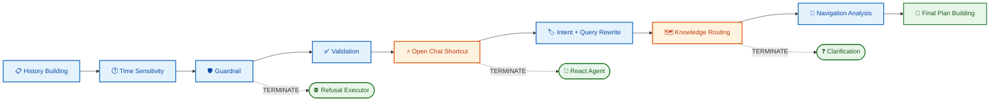
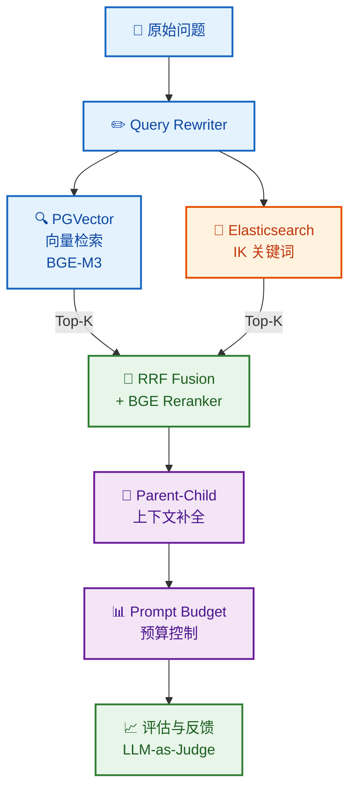
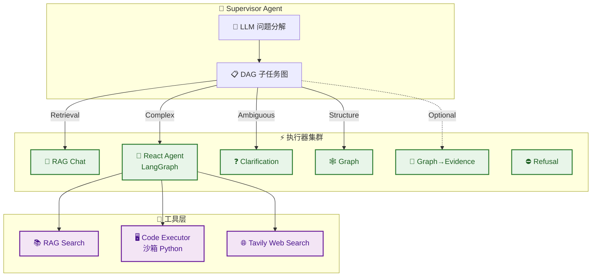
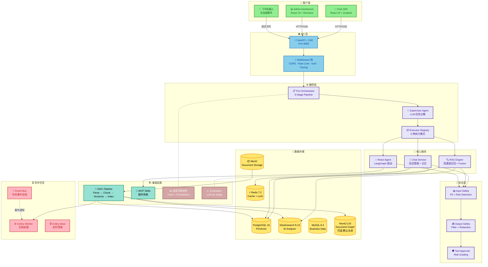

<div align="center">
  <h1>pipeline-rag</h1>
  <p><b>pipeline-rag — 企业级 AI Agent 智能体平台</b> — 检索增强 + 多智能体协作 + 长期记忆管理 + 工具调用</p>

  <p>
    <a href="#项目简介">简介</a> •
    <a href="#核心特性">特性</a> •
    <a href="#系统架构">架构</a> •
    <a href="#技术栈">技术栈</a> •
    <a href="#项目结构">结构</a> •
    <a href="#快速开始">快速开始</a>
  </p>

  <p>
    
    
    
    
    
    
    
    
  </p>
</div>

---

## 项目简介

面向企业知识库问答与复杂任务处理场景，构建集**检索增强生成、多智能体协作、长期记忆管理与工具调用于一体**的 AI Agent 平台。系统基于 FastAPI 与 LangGraph 构建，围绕**上下文精度、任务分解、记忆连续性**三大核心挑战，整合 PGVector + Elasticsearch 双通道召回、泛型 Pipeline 对话编排、Supervisor + DAG 任务分解、摘要压缩记忆等组件，形成了一套完整的企业级 AI Agent 解决方案。

### 核心能力

| 维度 | 能力 |
|------|------|
| **对话编排** | 9 阶段 Pipeline，三态信号（CONTINUE / SKIP / TERMINATE）驱动短路执行 |
| **知识召回** | PGVector 向量 + Elasticsearch 关键词双通道，RRF 融合 + Reranker |
| **多 Agent** | Supervisor 问题分解 + 6 种执行模式 + 异步并发子任务 |
| **长期记忆** | Summary Compression 结构化摘要 + 滑动窗口，支持 50+ 轮会话 |
| **文档处理** | 异步 Pipeline：解析（MinerU 增强）→ 分块（4 策略 + Contextual Chunking）→ 向量化 → 索引 |
| **数据源接入** | 手动上传 + S3 / 网页爬虫连接器自动导入（飞书/网页多渠道） |
| **引用溯源** | 回答附来源引用（chunk_id / 章节 / 原文），前端可展开查看 |
| **响应缓存** | 无历史上下文的确定性问答走 Redis 缓存，命中省全链路 LLM |
| **MCP 插件** | 基于 FastMCP 的 Skills 插件系统，工具自动发现与注册 |
| **安全控制** | PII 检测、输入/输出过滤、风险分级审批、沙箱执行 |
| **可观测性** | 自研 Trace 链路（span 瀑布 + 评估分数）+ Prometheus 指标 + LLM-as-Judge 质量评估 |

---

## 核心特性

### Pipeline 对话编排引擎

泛型 Pipeline 模式，请求拆分为 9 个独立 Stage：



每个 Stage 返回 CONTINUE / SKIP / TERMINATE 信号：
- **CONTINUE** — 更新上下文，进入下一 Stage
- **SKIP** — 跳过当前 Stage，继续后续
- **TERMINATE** — 终止管道，立即进入对应执行器

Post-Pipeline 可调用 Supervisor 进行 LLM 任务分解。

### 双通道 RAG 召回体系



- **PGVector** — 稠密向量语义检索（BGE-M3 Embedding）
- **Elasticsearch** — IK 分词器中文关键词检索
- **RRF 融合** — 将 Top-K 召回准确率从纯向量的 72% 提升至 91%
- **Reranker** — 可配置 BGE Reranker V2 重排序
- **Parent-Child** — Chunk 级别上下文补全，解决分块断裂问题
- **Contextual Chunking** — 分块时注入文档级上下文窗口（可开关，需重索引生效）

### 多 Agent Supervisor 架构



Supervisor 利用 LLM 自动分解复杂问题生成带依赖关系的子任务，结合拓扑分层与异步并发执行机制，完成多阶段任务协同处理。

### 数据源连接器与多渠道

平台支持多种内容接入方式，统一汇入文档处理流水线：

| 方式 | 说明 | 配置 |
|------|------|------|
| **手动上传** | Web 端直接上传文件（PDF/Word/TXT/MD/PPT/Excel） | — |
| **S3 连接器** | 扫描 S3 兼容存储（含 MinIO）的 bucket/prefix，按扩展名过滤后自动导入 | `CONNECTOR_S3_*`，任务 `document.import_s3` |
| **网页爬虫** | 通过 sitemap 或种子 URL 递归发现站点页面，trafilatura 提取正文转 Markdown 导入 | `CONNECTOR_WEB_*`，任务 `document.import_web` |
| **飞书机器人** | 长连接事件订阅，群里 @ 机器人提问，卡片流式回答 + 引用链接 | `FEISHU_*`（lark-oapi 长连接，无需公网回调） |

- 连接器统一基于 `DocumentConnector` 抽象（list / fetch / 触发流水线），新增数据源按同一模式扩展
- 飞书渠道按 (chat_id, open_id) 映射独立平台会话：私聊一人一会话，群聊每人独立上下文
- 所有渠道共享同一编排/检索/记忆/评估链路，可观测性 Trace 统一可查

### 响应缓存与断线续传

**响应缓存**：企业知识问答中「无历史上下文的确定性提问」（FAQ/制度/手册）重复率极高。
- 仅当会话**无历史上下文**（摘要为空）且模式为 auto/retrieval 时缓存——多轮上下文永不污染缓存
- 缓存键 = 规范化问题 + 模式 + 文档集（**跨会话复用**），TTL 默认 24h
- 命中时跳过编排/检索/生成，直接回放缓存答案与引用；会话记录仍正常落库
- 配置：`CHAT_CACHE_ENABLED` / `CHAT_CACHE_TTL_HOURS`

**SSE 断线续传**：流式回答期间网络抖动/服务发布不会丢失回答。
- 服务端将事件写入 Redis 缓冲（TTL 180s），客户端断线后自动重连（指数退避 ×3）并携带 `resume` 计数
- 服务端重放未消费事件（**不重复渲染**）：已完成则正常收尾；原流仍在执行则提示「执行中」

### 长期记忆架构

三种记忆策略，按场景切换：

| 策略 | 机制 | 适用场景 |
|------|------|----------|
| **Summary Compression** | 结构化摘要压缩历史 + 滑动窗口保留近期上下文，异步增量压缩 + 版本校验 | 生产推荐，50+ 轮长会话 |
| **Sliding Window** | 保留最近 N 轮完整对话原文 | 短期连续追问，Token 成本可控 |
| **No Memory** | 每轮独立，不保存任何历史 | 一次性查询，零开销 |

Summary Compression 长期摘要包含：会话目标、已确认事实、用户偏好与约束、已解决问题、待跟进问题、检索提示词等结构化字段。

### MCP Skills 插件系统

基于 FastMCP 构建的 Skills 插件系统，支持工具自动发现与注册：

| 内置 Skill | 功能 |
|------------|------|
| **Knowledge Retrieval** | 知识库检索与文档导航 |
| **Document Navigation** | 文档结构图谱导航（章节/条目/搜索） |
| **Web Research** | Tavily 网络搜索集成 |

Skills 可在运行时热插拔，通过 MCP 协议与 Agent 交互，支持外部工具扩展。

### 安全与合规

| 层 | 能力 |
|----|------|
| **输入过滤** | 关键词 + LLM 双通道风险检测，Presidio PII 检测 |
| **输出过滤** | 敏感信息脱敏，策略合规检查 |
| **风险分级** | 三级风险定级，高风险需要审批确认 |
| **工具审批** | 危险操作需显式用户授权 |
| **沙箱执行** | Code Executor 在隔离沙箱中运行 Python 代码 |

---

## 系统架构



---

## 技术栈

### 后端

| 分类 | 技术 | 版本 |
|------|------|------|
| **语言** | Python | >=3.11, <3.13 |
| **Web 框架** | FastAPI | 0.115 |
| **Agent 框架** | LangGraph | 0.3 |
| **ORM** | SQLAlchemy (async) | 2.0 |
| **数据库迁移** | Alembic | — |
| **向量数据库** | PostgreSQL 16 + PGVector | — |
| **搜索引擎** | Elasticsearch | 8.13.4 |
| **图数据库** | Neo4j（可选，默认关闭） | 5.20 |
| **缓存/锁** | Redis 7.2 + Redisson | — |
| **消息队列** | Celery + Redis | — |
| **对象存储** | MinIO | — |
| **LLM 客户端** | OpenAI SDK + httpx | — |
| **Prompt 模板** | Jinja2 | — |
| **MCP** | FastMCP | — |
| **PII 检测** | Microsoft Presidio | — |
| **追踪** | 自研 Trace（span 树 + MySQL 落库） | — |
| **指标** | Prometheus | — |
| **日志** | structlog | — |
| **文档解析** | Unstructured + MarkItDown + MinerU（可选增强） | — |
| **IM 渠道** | 飞书（lark-oapi 长连接） | — |
| **网页提取** | trafilatura | — |

### 前端

| 应用 | 技术栈 |
|------|--------|
| **用户端 (Chat SPA)** | React 19 + TypeScript + Vite + Zustand + Tailwind CSS 4 + react-markdown |
| **管理端 (Admin)** | React 19 + TypeScript + Vite + React Router + Recharts + Tailwind CSS 4 |

---

## 项目结构

```
pipeline-rag/
├── app/                              # 后端应用
│   ├── main.py                       # 应用入口 & Lifespan
│   ├── api/                          # REST API 路由
│   │   ├── router.py                 # 路由注册
│   │   ├── chat_session.py           # 会话管理 API
│   │   ├── chat_stream.py            # SSE 流式对话 API
│   │   └── manage_*.py              # 管理后台 API
│   ├── orchestrator/                 # 主编排器
│   │   ├── orchestrator.py           # 9-Stage Pipeline
│   │   ├── supervisor.py            # LLM 任务分解
│   │   ├── stages/                  # 各 Stage 实现
│   │   └── classifier.py            # 意图分类
│   ├── chat/                         # 对话服务
│   │   ├── service.py               # 对话业务逻辑
│   │   ├── memory.py                # 3 种记忆策略
│   │   ├── memory_compressor.py     # 异步摘要压缩
│   │   ├── store.py                 # 会话仓储
│   │   └── channels/                # 多渠道适配（飞书机器人）
│   ├── executors/                    # 执行器集群
│   │   ├── registry.py              # 执行器注册表
│   │   ├── rag.py                   # RAG Chat 执行器
│   │   ├── agent.py                 # React Agent 执行器
│   │   └── ...                      # 其他 4 种执行器
│   ├── rag/                          # RAG 引擎
│   │   ├── channels/                # 检索通道
│   │   │   ├── vector.py           # PGVector 向量通道
│   │   │   └── keyword.py          # ES 关键词通道
│   │   ├── fusion.py                # RRF 融合
│   │   ├── reranker.py              # BGE Reranker
│   │   ├── assembly.py             # Prompt 组装 + Budget
│   │   └── parent_block.py         # Parent-Child 上下文
│   ├── document/                     # 文档处理
│   │   ├── pipeline.py              # 文档处理编排
│   │   ├── parser.py                # 文档解析（含 MinerU 增强通道）
│   │   ├── mineru_parser.py         # MinerU 复杂版式解析（可选）
│   │   ├── chunker/                 # 4 种分块策略
│   │   ├── connectors/              # 数据源连接器（S3 / 网页爬虫）
│   │   ├── vectorizer.py            # 向量化（Contextual Chunking）
│   │   └── indexer.py               # 索引写入
│   ├── mcp/                          # MCP 插件系统
│   │   ├── server.py                # MCP 服务器
│   │   ├── skill_registry.py        # Skills 注册中心
│   │   └── skills/                  # 内置 Skills
│   ├── safety/                       # 安全层
│   │   ├── input.py                 # 输入过滤
│   │   ├── output.py                # 输出过滤
│   │   ├── presidio_pii.py          # PII 检测
│   │   └── tool_registry.py         # 工具审批
│   ├── observability/               # 可观测性（自研体系）
│   │   ├── tracer.py                # Trace 追踪（span 树 + 采样）
│   │   ├── storage.py               # Trace 落库（trace/span/score）
│   │   ├── metrics/                 # RAG 质量评估（LLM-as-Judge）
│   │   └── models.py               # 评估数据模型
│   ├── infra/                        # 基础设施
│   │   ├── pg.py                    # PostgreSQL 连接
│   │   ├── es.py                    # Elasticsearch 连接
│   │   ├── neo4j.py                 # Neo4j 连接
│   │   ├── minio.py                 # MinIO 存储
│   │   └── tracing.py              # OTel 初始化（deprecated，默认关闭）
│   ├── common/                       # 共享基础库
│   │   ├── pipeline.py              # 泛型 Pipeline 模式
│   │   ├── llm_client.py            # LLM 客户端
│   │   ├── jinja.py                 # Jinja2 模板引擎
│   │   └── sse.py                   # SSE 工具
│   ├── config/                       # 配置管理
│   ├── db/                           # 数据库层
│   │   ├── models/                  # SQLAlchemy 模型
│   │   └── repositories/           # 仓储层
│   └── api/schemas/                 # Pydantic Schema
├── frontend/                         # 前端 SPA
│   └── src/
│       ├── pages/                    # 页面组件
│       ├── components/               # UI 组件
│       ├── store/                    # Zustand 状态
│       └── lib/                      # API 客户端
├── alembic/                          # 数据库迁移
├── scripts/                          # 工具脚本
├── demo_docs/                        # 演示文档
├── docker-compose.yml               # 容器编排
├── Dockerfile                        # 多阶段构建
├── pyproject.toml                    # 项目元数据
└── worker.py                         # Celery 入口
```

---

## 管理后台功能

| 模块 | 功能 |
|------|------|
| **Dashboard** | 运营数据概览、对话统计、Token 用量 |
| **文档中心** | 文档上传、处理策略配置、执行流水线可视化 |
| **Chunk 管理** | 分块结果查看、策略对比、质量分析 |
| **知识路由** | 查询→知识域映射管理、路由轨迹追踪 |
| **RAG 评估** | Faithfulness / Relevancy / Precision / Recall / Correctness |
| **对话观测** | 会话列表 → 单轮执行链路（通道召回/检索结果） |
| **Trace 链路** | span 瀑布 + 评估分数 + 指标卡片（自研 trace 三表） |
| **观测指标** | Prometheus 指标看板（时延/Token/成本/降级） |
| **评估数据集** | 离线评估运行、Regression 测试（--min-* 阈值门禁） |

---

## 快速开始

### 环境要求

- Python 3.11+
- Docker & Docker Compose
- Node.js 20+ (前端)

### 启动基础设施

```bash
docker compose up -d
```

### 安装并启动后端

```bash
# 安装依赖
uv sync
# 可选：完整文档解析（unstructured 增强通道，复杂 PDF/Word/PPT 版式）
# 不装时自动降级 markitdown，复杂版式可启用 MinerU 增强通道
uv sync --extra full-parsing

# 数据库迁移
alembic upgrade head

# 启动 API 服务
# ⚠️ 必须单 worker 运行：SSE 会话状态为进程内实现（ChatRuntimeRegistry），
#    多 worker / 多副本会导致「停止会话 / 状态查询」失效；启动时会自动检测并告警。
fastapi dev app/main.py --port 8080        # 开发
# 生产部署（Docker 默认）：uvicorn app.main:app --host 0.0.0.0 --port 8080 \
#   --timeout-graceful-shutdown 60   # SSE 长连接优雅停机

# 启动 Celery Worker（新终端）
# 两种等价入口：`python worker.py` 或 `celery -A app.celery_app worker`
# （与 docker-compose 中 celery-worker 服务一致；含 beat 调度需另起 celery beat）
uv run python worker.py
```

### 启动前端

```bash
cd frontend
npm install
npm run dev
```

### 访问入口

| 入口 | 地址 |
|------|------|
| API 服务 | `http://localhost:8080` |
| Chat 前端 | `http://localhost:5173` |
| Admin 后台 | `http://localhost:5173/admin` |
| API 文档 | `http://localhost:8080/docs` |
| Prometheus 指标 | `http://localhost:8080/metrics` |

### 关键配置（.env）

| 配置项 | 说明 |
|--------|------|
| `CHAT_CACHE_ENABLED` / `CHAT_CACHE_TTL_HOURS` | 响应缓存开关与 TTL（默认关 / 24h） |
| `CONNECTOR_S3_*` | S3 数据源连接器（扫描 bucket 自动导入） |
| `CONNECTOR_WEB_*` | 网页爬虫连接器（sitemap/种子递归抓取） |
| `FEISHU_*` | 飞书机器人渠道（长连接事件订阅 + 卡片流式回复） |
| `MINERU_*` | MinerU 复杂版式解析增强通道（失败自动降级） |

完整变量清单见 `.env.example`。

### 开发命令

```bash
# 代码检查
ruff check . && ruff format --check .

# 类型检查
mypy app/

# 测试
pytest tests/ -v

# 集成测试（需先 docker compose up -d 起基础设施，不可达自动 skip）
pytest tests/integration -v
```
