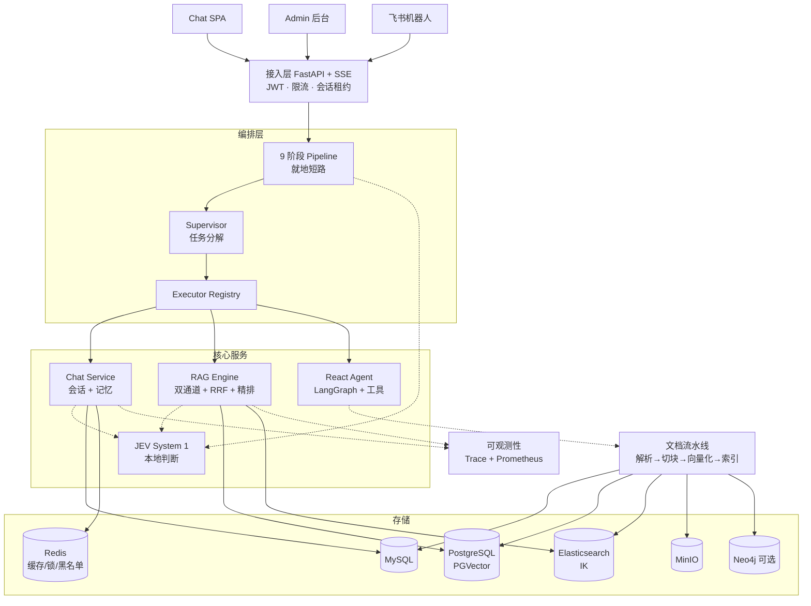

<div align="center">
  <h1>pipeline-rag</h1>
  <p>私有知识库问答与 AI Agent 平台 · 检索增强 + 多智能体协作 + 长期记忆 + 本地判断决策</p>

  <p>
    <a href="#项目简介">简介</a> •
    <a href="#核心能力">能力</a> •
    <a href="#系统架构">架构</a> •
    <a href="#技术栈">技术栈</a> •
    <a href="#快速开始">快速开始</a> •
    <a href="#docker-部署">部署</a>
  </p>

  <p>
    
    
    
    
    
    
    
  </p>
</div>

---

## 项目简介

面向知识库问答与复杂任务处理场景的 AI Agent 平台。系统基于 FastAPI 与 LangGraph 构建，围绕上下文精度、任务分解、记忆连续性三个问题，整合 PGVector + Elasticsearch 双通道召回、泛型 Pipeline 对话编排、Supervisor 任务分解、结构化摘要记忆等组件，并提供一套本地部署的 JEV 判断决策层替代大模型的判断类调用。

## 核心能力

| 维度 | 能力 |
|------|------|
| **对话编排** | 9 阶段 Pipeline，规则层就地短路；意图分流规则快路径 + JEV 语义兜底 |
| **知识召回** | PGVector 向量 + Elasticsearch BM25 双通道 → RRF 融合 → Cross-Encoder 精排 → 证据闸门 |
| **多 Agent** | Supervisor 任务分解（LangGraph）+ 拓扑分层并发 + 结果汇总 |
| **长期记忆** | 结构化摘要（`summary_version` CAS 乐观锁）+ 滑动窗口；可选用户事实记忆（pgvector） |
| **文档接入** | 本地目录 / zip / 批量上传 + S3 / 网页连接器；解析 → 两阶段父子切块 → 向量化 → 索引 |
| **引用溯源** | 回答附来源引用（chunk_id / 章节 / 原文），前端可展开 |
| **本地判断（JEV）** | 护栏 / 意图 / 引用审计 / 证据充分性 / 质量审核 / 评测走本地单次前向，替代 LLM-as-Judge |
| **响应缓存** | 无历史上下文的确定性问答走 Redis 回放；SSE 断线续传 |
| **安全** | JWT + JTI 即时吊销、Lua 滑动窗口限流、Luhn 校验 PII、AST + `setrlimit` 沙箱、工具风险分级 |
| **可观测性** | 自研 Trace（span 树落库）+ Prometheus；可选 Langfuse / OpenTelemetry |

## 系统架构


```mermaid
flowchart TB
    UI["Chat SPA"]
    ADMIN["Admin 后台"]
    FEISHU["飞书机器人"]

    FW["接入层 FastAPI + SSE<br/>JWT · 限流 · 会话租约"]

    subgraph Orchestration["编排层"]
        ORC["9 阶段 Pipeline<br/>就地短路"]
        SUP["Supervisor<br/>任务分解"]
        REG["Executor Registry"]
    end

    subgraph Services["核心服务"]
        CHAT["Chat Service<br/>会话 + 记忆"]
        RAG["RAG Engine<br/>双通道 + RRF + 精排"]
        AGENT["React Agent<br/>LangGraph + 工具"]
        JEV["JEV System 1<br/>本地判断"]
    end

    subgraph Storage["存储"]
        PG[("PostgreSQL<br/>PGVector")]
        ES[("Elasticsearch<br/>IK")]
        MYSQL[("MySQL")]
        RD[("Redis<br/>缓存/锁/黑名单")]
        MINIO[("MinIO")]
        NEO4J[("Neo4j 可选")]
    end

    DOC["文档流水线<br/>解析→切块→向量化→索引"]
    OBS["可观测性<br/>Trace + Prometheus"]

    UI --> FW
    ADMIN --> FW
    FEISHU --> FW
    FW --> ORC --> SUP --> REG
    REG --> CHAT
    REG --> RAG
    REG --> AGENT
    ORC -.-> JEV
    RAG -.-> JEV
    CHAT -.-> JEV
    CHAT --> MYSQL
    CHAT --> RD
    RAG --> PG
    RAG --> ES
    AGENT -.-> DOC
    DOC --> MYSQL
    DOC --> PG
    DOC --> ES
    DOC --> MINIO
    DOC --> NEO4J
    CHAT -.-> OBS
    RAG -.-> OBS
```

- **接入层**：验签、限流、会话租约；SSE 长连接推流。
- **编排层**：9 阶段流水线逐级推演，护栏 / 闲聊 / 路由可尽早短路；产出 `ExecutionPlan` 后可选 Supervisor 分解。
- **核心服务**：会话与记忆、RAG 检索、ReAct Agent。
- **存储**：MySQL（元数据/父块/消息）、PGVector（子块向量）、ES（BM25）、Redis（缓存/锁/黑名单）、MinIO（原文）、Neo4j（目录树，可选）。
- **JEV**：本地判断微服务，供编排与执行层在判断点调用。

## 关键设计

- **9 阶段就地短路**：历史 → 时效 → 护栏 → 校验 → 闲聊 → 改写分流 → 路由 → 导航 → 组装计划；违规返回拒答、闲聊走轻量直答、意图模糊触发澄清，不需要的请求不进入检索与生成。
- **两阶段父子切块**：父块（800–1500 字）存 MySQL 供完整上下文投喂，子块（256–512 Token）存 PGVector / ES 供高精度检索；命中子块后按 `parent_block_id` 回填父块，父块查询加进程内 LRU 缓存与 TTL 淘汰机制。
- **双通道 RRF**：向量与词法通道并发召回，按排名位次做 RRF（k=60）融合，避免分数量纲冲突；再经精排与证据闸门过滤。
- **短事务解耦推流**：数据库操作收敛为请求首尾两段短事务，SSE 推流期间数据库连接占用为 0；Redis 会话租约平滑时钟探活防连点乱序。
- **分层记忆**：滑动窗口保留近期原文，超出部分异步压缩为结构化摘要，`summary_version` CAS 乐观锁防并发脏写；可选用户事实记忆跨会话复用。
- **JEV 本地判断**：自建 `jev-service`（Qwen2.5-1.5B），单次前向读 logits 输出 Noul / Choice / Score 三类强类型结论，替代判断类 LLM 调用；统一入口 `jev_decide`，逐环节开关，灰区或服务不可达时回退 LLM / 规则。
- **安全纵深**：输入（PII + 注入）→ 编排护栏（规则 + JEV 语义）→ 输出过滤 → 工具风险分级与沙箱执行。
- **响应缓存**：仅对无历史、确定性问答生效，文档变更时按 doc_id 精准失效。

## 技术栈

### 后端

| 分类 | 技术 |
|------|------|
| 语言 / 框架 | Python 3.11 · Python 3.12 · FastAPI · LangGraph · SQLAlchemy 2.0 (async) · Alembic |
| 存储 | PostgreSQL 16 + PGVector · Elasticsearch 8.13（IK） · MySQL 8.4 · Neo4j 5.20（可选） · MinIO · Redis 7.2 |
| 异步 | Celery + Redis |
| 判断决策 | JEV System 1（`jev_service/`，Qwen2.5-1.5B，本地 / Docker） |
| 文档解析 | Unstructured + MarkItDown + MinerU（可选增强） · trafilatura（网页） |
| 安全 | Microsoft Presidio（PII） |
| 可观测性 | 自研 Trace（span 树 + MySQL） · Prometheus · structlog · 可选 Langfuse / OpenTelemetry |
| 评估 | 自实现 RAGAS 指标（faithfulness / relevancy / precision / recall / correctness） |

### 前端

| 应用 | 技术栈 |
|------|--------|
| 用户端 (Chat SPA) | React 19 + TypeScript + Vite + Zustand + Tailwind CSS 4 + react-markdown |
| 管理端 (Admin) | React 19 + TypeScript + Vite + React Router + Recharts + Tailwind CSS 4 |

## 项目结构

```
pipeline-rag/
├── app/                  REST 路由、流水线编排、执行器与基础设施
│   ├── api/              REST 路由与 SSE 流式接口
│   ├── orchestrator/     9 阶段流水线、Supervisor、意图改写与路由
│   ├── chat/             会话服务、滑动窗口与结构化长期记忆
│   ├── executors/        执行器集群（RAG / Agent / Graph / Clarification / Refusal）
│   ├── rag/              检索通道、RRF 融合、精排、父块提升与 Prompt 组装
│   ├── document/         文档解析、父子切块、连接器、向量化与索引
│   ├── safety/           输入输出过滤、PII 校验与工具风险沙箱
│   ├── observability/    自研 Trace、Prometheus 指标与 OTel
│   ├── mcp/              SkillRegistry 与 FastMCP Server
│   ├── infra/            数据库与存储基础设施客户端
│   ├── common/           泛型 Pipeline、LLM 客户端与 SSE 工具
│   ├── config/           系统配置管理
│   └── db/               ORM 模型与仓储
├── jev_service/          JEV System 1 本地判断微服务
├── frontend/             React SPA 用户端与 Admin 管理端
├── alembic/              数据库版本迁移
├── scripts/              评测、基准测试与工具脚本
├── bin/                  部署、验证与启停脚本
└── docker-compose*.yml   Docker 容器编排定义
```

## 快速开始

### 环境要求

- Python 3.11+ 或 3.12+
- Docker & Docker Compose
- Node.js 20+（前端构建）

### 启动基础设施

```bash
docker compose up -d
```

### 安装与启动后端

安装依赖（可选安装完整文档解析 unstructured 通道）：

```bash
uv sync
uv sync --extra full-parsing
```

数据库迁移（空库可直接重建）：

```bash
alembic upgrade head
```

启动 API 服务：

```bash
fastapi dev app/main.py --port 8080
```

生产模式启动命令：

```bash
uvicorn app.main:app --host 0.0.0.0 --port 8080 --workers 4
```

启动 Celery 异步任务处理 Worker：

```bash
uv run python worker.py
```

### 启动前端

```bash
cd frontend
npm install
npm run dev
```

### 访问入口

| 入口 | 地址 |
|------|------|
| API 服务 | `http://localhost:8080` |
| Chat 前端 | `http://localhost:5173` |
| Admin 后台 | `http://localhost:5173/admin` |
| API 文档 | `http://localhost:8080/docs` |
| Prometheus 指标 | `http://localhost:8080/metrics` |

### 关键配置（.env）

| 配置项 | 说明 |
|--------|------|
| `CHAT_CACHE_ENABLED` / `CHAT_CACHE_TTL_HOURS` | 响应缓存开关与 TTL（默认关 / 24h） |
| `RAG_USER_MEMORY_ENABLED` | 用户事实记忆开关（默认关） |
| `JEV_*` | JEV 服务地址与各环节开关（护栏/意图/引用/证据/质量/评测等） |
| `CONNECTOR_S3_*` / `CONNECTOR_WEB_*` | S3 / 网页连接器 |
| `FEISHU_*` | 飞书机器人渠道（长连接事件订阅 + 卡片流式回复） |
| `MINERU_*` | MinerU 复杂版式解析增强（失败自动降级） |
| `LANGFUSE_*` / `OTEL_*` | 可观测性上报（默认关） |

完整变量清单见 `.env.example`。

### 开发常用命令

代码静态检查与格式验证：

```bash
ruff check . && ruff format --check .
```

静态类型检查：

```bash
mypy app/
```

执行单元测试：

```bash
pytest tests/ -v
```

执行真实基础设施集成测试：

```bash
pytest tests/integration -v
```

JEV 决策 A/B 测试验证：

```bash
make eval-ab
```

## Docker 部署

### 一键部署

首次部署时复制环境配置模板并填写必要密钥：

```bash
cp .env.example .env
```

启动基础设施与应用服务：

```bash
./bin/deploy.sh
```

如需启动自托管 Langfuse 观测栈，添加参数：

```bash
./bin/deploy.sh --with-observability
```

执行分层健康检查与验证：

```bash
./bin/verify-deploy.sh
```

数据库表结构由 compose 中的独立 `migrate` 服务在应用启动前自动执行 `alembic upgrade head`，无需手动建表。

### 常用 Makefile 指令

```bash
make help
make up
make down
make migrate
make verify
make jev-up
make jev-logs
```

### 服务与端口分配

| 层级 | 服务 | 宿主机端口（默认） |
|---|---|---|
| 基础设施 | mysql / postgres / elasticsearch / neo4j / redis / minio | 3306 / 5432 / 9200 / 7474·7687 / 6379 / 9000·9001 |
| 业务核心 | app（FastAPI，含 `/metrics` `/health/*`） | `APP_PORT`（默认 8080） |
| 异步后台 | celery-worker / celery-beat / jev-service | —（无对外端口） |
| 可观测性 | langfuse-web | `LANGFUSE_WEB_PORT`（默认 3000） |
| 前端服务 | frontend（nginx 托管与反代） | `FRONTEND_PORT`（默认 80） |

> 基础设施端口仅在开发调试模式下对外发布；在生产部署脚本中默认不对外暴露端口，确保最小暴露面。
