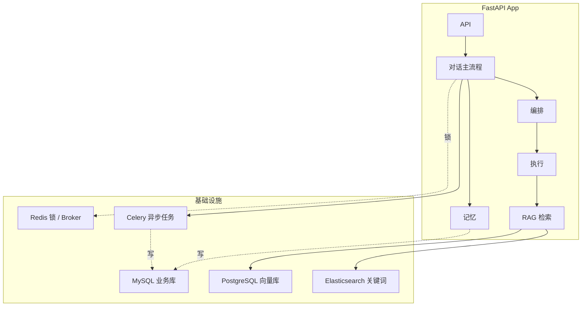

# 主题零：项目总览 —— Pipeline RAG 对话系统

> 总览文档：串起 01~04 四个技术主题，提供"项目全景 → 架构分层 → 数据流 → 组件地图 → 面试开场"的完整叙事。
> 每个主题的细节见对应文档，本页负责把整条线讲通。

---

## 1. 项目一句话

**面向企业内部知识库的 RAG 对话系统**：用户提问后，系统经过"编排 → 执行 → 记忆"三层处理，能区分知识问答、开放聊天、文档歧义澄清、复合问题拆解等不同场景，流式返回带引用的回答，并支持几十轮连续追问。

> 一句话定位（面试开场）：
> "这不是一个'接了个 LLM 的问答接口'，而是一个把提问拆成可控流水线的对话引擎：编排层决定'怎么答'，执行层负责'答出来'，记忆层保证'连续追问不丢事实'。三层解耦，每一层都能独立观测、独立降级。"

---

## 2. 系统全景（基础设施拓扑）

### 基础设施拓扑



### 为什么是这套组件（选型一句话）

| 组件 | 职责 | 为什么选它 |
|---|---|---|
| **MySQL** | 业务库：文档元数据、对话记录、摘要、评估数据、LangGraph 检查点 | 事务 + 关系建模，成熟稳定；supervisor 图状态也存这里 |
| **PostgreSQL + PGVector** | 向量检索（主题三） | 向量 + 结构化过滤一体，同体系省组件 |
| **Elasticsearch** | 关键词检索 + IK 分词 + 导航/路由索引（主题三） | 字段加权、短语/通配灵活，中文分词成熟 |
| **Neo4j** | 文档结构图谱（章节导航，主题一 Stage 9 相关） | 章节/步骤的父子、前后关系天然是图结构 |
| **Redis** | 分布式锁、限流、Celery broker | 单组件多用途，锁用于防会话并发重入 |
| **MinIO** | 原文件对象存储 | S3 兼容，文档原始文件保存 |
| **Celery** | 异步任务：记忆压缩、评估（主题四） | 队列解耦，后台任务不拖在线延迟 |
| **OTel + Prometheus** | 全链路 Trace + 指标（面试工程化加分项） | 观测体系落库，坏 case 可回溯 |

---

## 3. 架构分层（核心叙事）

系统在逻辑上分四层，**每层只管一件事，层间靠契约对接**：

```
┌─────────────────────────────────────────────────────────────┐
│ ① 编排层（Decide）—— 决定"怎么答"                            │
│    orchestrator：10 Stage Pipeline（主题一）                   │
│    + Supervisor 复合问题分解（主题二）                         │
│    产出：ExecutionPlan（模式 + 子问题 + 目标文档 + 历史）       │
├─────────────────────────────────────────────────────────────┤
│ ② 执行层（Execute）—— 负责"答出来"                           │
│    executors 按 plan.mode 分发：RAG 检索 / 开放聊天 /          │
│    多智能体并行 / 澄清 / 图谱                                 │
├─────────────────────────────────────────────────────────────┤
│ ③ 检索层（Retrieve）—— 证据来源                              │
│    rag：双通道召回 + RRF + Parent-Child + Rerank（主题三）      │
│    agent：工具调用 / MCP skill                                │
├─────────────────────────────────────────────────────────────┤
│ ④ 记忆层（Remember）—— 连续性保证                            │
│    memory：窗口 + 结构化摘要 + 异步压缩（主题四）               │
│    加载在①之前，回写在回答完成之后                            │
└─────────────────────────────────────────────────────────────┘
```

**为什么这样分层（面试核心论点）**：
- **决策与执行解耦**：编排只产出计划，执行只看计划——加新模式不碰编排，加执行器不碰决策；
- **每层可降级**：编排短路省成本、检索通道降级保可用、记忆异步不拖延迟；
- **每层可观测**：Trace 贯穿四层，"这轮答错了"能定位是决策错、执行错、检索错还是记忆错。

---

## 4. 一次请求的完整旅程（数据流）

```
用户提问（SSE 流式）
  │
  ▼
[入口] 参数规范化 → 定位/创建会话 → Redis 租约锁（防并发重入）
  │
  ▼
[记忆加载] 读该会话历史：长期摘要 + 最近 4 轮原文   ←── ④ 记忆层
  │
  ▼
[编排] 10 Stage Pipeline：
  历史上下文 → 时间检测 → 护栏(短路拒绝) → 校验 → 开放聊天(短路)
  → 意图分类(短路) → 改写(SKIP) → 知识路由(短路澄清) → 导航分析 → 构建计划
  │
  ▼
[后置] Supervisor 分解（复合问题才触发）   ←── ② 层内的子决策
  │
  ▼
[执行分发] 按 plan.mode → RAG 检索 / 开放 / 多智能体 / 澄清
  │
  ▼
[RAG 路径内部] 双通道召回 → RRF → Parent-Child → Rerank → Prompt 组装 → LLM 生成
  │                                      ←── ③ 检索层
  ▼
[收尾] 落库本轮问答 + 触发异步记忆压缩 → 生成会话标题 → 释放锁
                                      ←── ④ 记忆层回写
```

---

## 5. 四大技术主题与简历的映射

| 简历原文（压缩版） | 对应主题 | 一句话讲透 |
|---|---|---|
| 泛型 Pipeline 10 Stage + 三态信号短路，延迟降约 35% | **01_Pipeline编排引擎** | 决策显式化 + 能短则短，短路省掉后续 LLM 调用 |
| Supervisor + DAG 分解 + 拓扑分层异步并发 | **02_SupervisorDAG任务分解** | LLM 泛化拆解 + 规则/评审双兜底 + 能并行则并行 |
| PGVector + ES 双通道 + RRF + Parent-Child + Reranker，Top-5 召回 72%→91% | **03_双通道召回RAG** | 语义靠向量、精确靠关键词，召回靠广、精排靠准 |
| Summary Compression 记忆 + 异步增量 + 版本校验，50+ 轮一致 | **04_长期记忆压缩** | 窗口管近、摘要管长，游标+CAS 保证摘要不倒退 |

**主题间怎么串（面试主动引导线）**：
```
记忆(④)的检索提示喂给检索(③) → 编排(①)决定走哪条路径
→ 复合问题进 Supervisor(②) → 多智能体并行执行时每个子任务
   又走一遍检索(③) → 最终回答回写到记忆(④)
```
这是一个**闭环**：记忆影响决策、决策影响检索、检索结果回写记忆。主动把这条闭环讲出来，面试官会看到你是"整体设计者"而非"模块实现者"。

---

## 6. 工程化底座（Demo 与生产的分界线）

| 维度 | 做了什么 |
|---|---|
| **可观测** | 全链路 Trace（编排各 Stage/检索各通道/生成各阶段逐段计时）；状态机留痕（加锁→记忆加载→编排→执行→完成/失败/取消）；Prometheus 指标（请求量、模式占比、通道失败、token 用量） |
| **故障防护** | 外部依赖（LLM/ES/PG/Redis）独立熔断器；多级降级（ES 挂→PG 模糊匹配，Rerank 挂→跳过，LLM 挂→模型降级）；Redis 锁 + 进程注册表防并发重入 |
| **效果评估** | 检索层对比实验（多策略打同一数据集选优——72→91 的来源）；生成层按比例采样 LLM 评分（忠实度/相关性）；Golden Dataset 回归防回退 |
| **成本控制** | 上下文预算裁剪、重复引用不重复塞、记忆体量与轮数解耦、编排短路省调用 |

---

## 7. 面试高频总问（全景级）

**Q：这个项目最核心的架构决策是什么？**
> 答：决策与执行解耦。编排层只产出 ExecutionPlan，不直接回答任何问题；执行层只看计划干活。这个决定带来的连锁好处：加新模式不碰编排、每层可独立降级、答错了能定位是"决策错还是执行错"。四大模块全是围绕这条主线展开的。

**Q：它和直接调 LangChain / LlamaIndex 的 Agent 有什么区别？**
> 答：工具类框架解决的是"怎么调 LLM、怎么接工具"；我们解决的是"一个系统怎么服务性质差异巨大的请求"。所以我们是把编排、检索、记忆当成一等公民来设计，框架（LangGraph）只用在确实需要图编排的 Supervisor 模块，主编排和检索都是自研。框架是零件，不是架构。

**Q：如果让你重新设计，哪里会改？**
> 答：①检索与编排的衔接：目前执行计划在编排阶段定死，未来可让检索结果反向影响执行（先粗检再定路径）；②Supervisor 双实现：等 LangGraph 稳定后收敛为单实现，减少维护成本；③记忆：给摘要加"关键事实置信度"，压缩时对高危事实做保真校验。这三个方向都能用现有可观测数据验证收益。

**Q：这个系统最大的风险/难点是什么？**
> 答：两个。一是**决策可靠**——LLM 判断路径可能出错（把知识问题当闲聊），靠置信度阈值 + 校验兜底 + 采样评估压风险；二是**检索质量**——证据找错一切白搭，靠双通道互补 + Rerank + 证据闸门 + 坏 case 留痕定位。这两个都是"设计看起来简单、线上持续迭代"的问题。

---

## 8. 各主题入口速查

| 想看 | 文件 |
|---|---|
| 整体叙事（本页） | `00_项目总览.md` |
| 编排引擎：10 Stage / 三态信号 / 短路 | `01_Pipeline编排引擎.md` |
| 多智能体：LLM 分解 / 校验 / DAG 并行 | `02_SupervisorDAG任务分解.md` |
| 检索：双通道 / RRF / Parent-Child / Rerank | `03_双通道召回RAG.md` |
| 记忆：窗口+摘要 / 异步压缩 / CAS 一致性 | `04_长期记忆压缩.md` |
